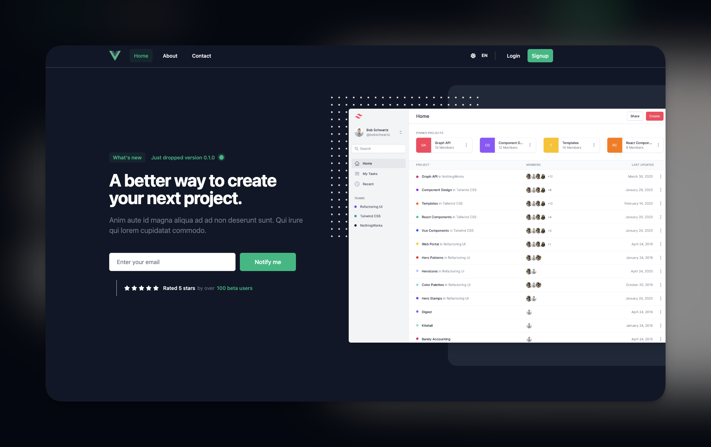

[](https://www.codacy.com/gh/HugoRCD/vuejs-boilerplate/dashboard?utm_source=github.com&amp;utm_medium=referral&amp;utm_content=HugoRCD/vuejs-boilerplate&amp;utm_campaign=Badge_Grade)

# Introduction

Here is a completely working VueJS Template ! This app is a single-page application built with VueJS and includes features such as OAuth authentication with Google, translation with I18n, and a dark and light theme and many more...
Everything is connected and ready to use to a working api in NestJS check here !!! [NestJS Template](https://github.com/HugoRCD/nestjs-boilerplate)

## Features
- OAuth authentication with Google
- Translation with I18n
- Dark and light theme
- Authentication with JSON Web Tokens (JWTs) and refresh tokens
- Working forgot password
- Role Feature
- Admin Dashboard
- Support Ticket integration
- This template is fully responsive and use CSS pre-processors (SCSS)

## Getting Started
To get started with this VueJS App, follow these steps:

### Clone the repository:
```
git clone git@github.com:HugoRCD/vuejs-boilerplate.git
```

### Install dependencies:
```
yarn install
```

### Start the development server:
```
yarn run serve
```

Now you can open the app in your browser at http://localhost:8080

## Documentation
For more information on how to use this VueJS App, see the [documentation](./docs).

## License
This VueJS Template is licensed under the [MIT License](./LICENSE).

